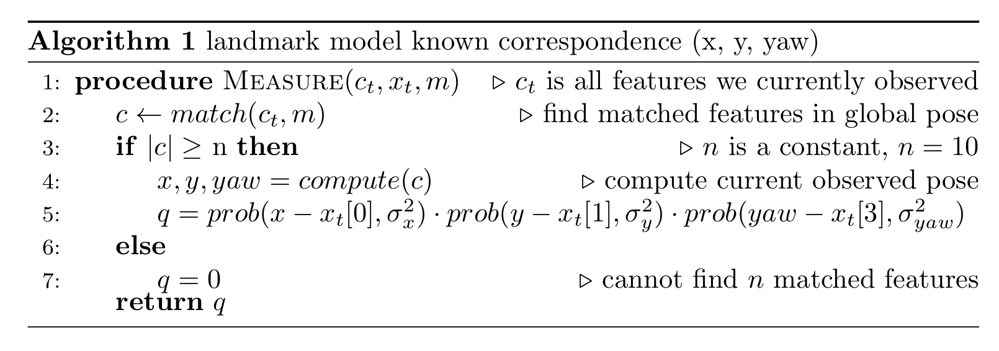

# Our SLAM Implementation {#localization-slam-slam-implementation status=ready}

As mentioned before, each particle holds a complete estimate of the map. Altogether, our FastSLAM particles will consist of a pose (x,y), a list of landmark objects, and a weight. The landmark objects will each store a pose (x,y), a 2x2 covariance matrix, a descriptor, and a counter. We will discuss the descriptor and counter shortly.

The motion prediction, resampling, and pose estimation steps in FastSLAM will not be different than in MC Localization. In fact, you can reuse much of your code from MC Localization for these steps!

The measurement update, however, is a little more involved. Since we no longer have a map of the environment available to compare with the current camera frame to weight each particle, we will need some way to judge the confidence of a particle based on the set of landmarks.

To accomplish this, we will attempt to match the current features extracted from the camera feed with the landmarks stored in each particle. This is why we store a feature descriptor with each landmark object.

When updating each particle, we will attempt to match each newly observed feature *with only those landmarks which lie in a close range around the particle's pose.* This step is very important as it will ensure that the map stored in each particle is conditioned on the robot pose represented by that particle. Otherwise, all particles will have the same weights and having a filter with many particles would be pointless!

Each observed feature will either match with a landmark in the particle or it will not. If the feature matches a landmark that was already observed, you should "reward" that particle by increasing its weight. This is because *we are more confident that a particle's pose is correct if the landmarks in the map around that particle are matching with the features we currently observe.* At this time, you must also update the pose and covariance of the landmark using data from the newly observed feature.

If the observed feature does not match an existing landmark, you should add it to this landmark's map and "punish" the particle's weight because extending the map with new landmarks decreases our confidence in its correctness.

We would also like to have some scheme to ensure that dubious landmarks in the map get discarded. Otherwise, the map will grow too large to store. To implement this, each landmark will have a counter. Increment the counter each time the landmark gets revisited, and decrement it if the landmark was in a close range to the pose of the particle, yet not matched to.  If the counter goes below a certain threshold, remove that landmark from the map. This ensures that landmarks which *should* have been seen, yet were not, are removed. Removing a landmark from the map is also a good time to punish the weight of that particle.

The exact weighting scheme for the measurement update will be left up to you. **Hint**: when you punish a particle, rather than reduce its weight, you should increase it by a positive value that is relatively smaller than the "reward"  value. This ensures that the weights of the particles all have the same sign.

The last part of the implementation we have not covered is the process of setting the pose and covariance of new landmarks, and updating them when a landmark is revisited. To do this, FastSLAM uses the EKF or Extended Kalman Filter. The EKF is very similar to the UKF which you implemented in project 3, but with a different scheme for linearizing the motion and measurement functions. Since you have already implemented similar code in that project, you will be provided with two functions:

    add_landmark
    update_landmark
which will take care of all of the EKF linear algebra for you.

## More Formally:

The state is the drone's position and yaw, assuming we are mostly horizontal:
$$
x_t = \left[\begin{array}{c}l
x\\
y\\
z\\
\psi
\end{array}\right]
$$

We assume velocity control, so we move in the plane, up and down, and
yaw.  This is set with the *Mode* messages in *pidrone_pkg*.
(Note that the $z$ in the *Mode* message is a position and not a
velocity.  However I want to change this, and propose we ignore $z$
for now anyway - just keep a constant height.)

$$
u_t = \left[\begin{array}{c}
\dot{x}\\
\dot{y}\\
\dot{z}\\
\dot{\psi}
\end{array}\right]
$$

Then the transition function is: 
$$
g(x_t, u_t, \Delta t) = \left[
\begin{array}{c}
x_{t,x} + u_{t,\dot{x}\Delta t}\\
x_{t,y} + u_{t,\dot{y}\Delta t}\\
x_{t,z} + u_{t,\dot{z}\Delta t}\\
x_{t,\psi} + u_{t,\dot{\psi}\Delta t}\\
\end{array}
\right]
$$

Following Thrun 2005, we assume that we can
process a camera image and localize each feature in the image, if it
is present.  We will then obtain a range, $r$ and bearing, $\phi$ for
the features in the image.
We assume access to a map,  $$m = \left\{m_1,m_2,\dots,m_n\right\}$$ the
set of all landmarks.  Each $m_i$ is the location $x,y,z$ consisting
of the location of the $i$th landmark.

$$
  f(z_t) = {f_t^1,f_t^2,...,}
$$

We assume each feature is an independent measurement:
$$
  p(f(z_t) | x_t, m) = \prod_i p(r_t^i,\phi_t^i,s_t^i| x_t,m)
$$

Then the measurement model for each feature is: 
$$
  h(i, x_t, m) = \left[ \begin{array}{c}
      \sqrt{(m_{i,x} - x)^2 + (m_{i,y} - y )^2}\\
      \text{atan2}(m_{i,y} - y, m_{i,x} - x) - \psi)\\
      s_i
      \end{array}
      \right]
$$
Number of features, the feature detection and computation method (currently ORB, can be sift or surf), number of particles, could be changed for better performance.

<figure id="features">
    <figcaption>Algorithm 1: Landmark model known correspondence (x, y, yaw)</figcaption>
    
</figure>

This math follows:
Hugh Durrant-Whyte and Tim Bailey. Simultaneous localization and mapping:part i. *IEEE robotics and automation magazine*, 13(2):99110, 2006.

Sebastian Thrun, Wolfram Burgard, and Dieter Fox. *Probabilistic robotics.* MITpress, 2005.
